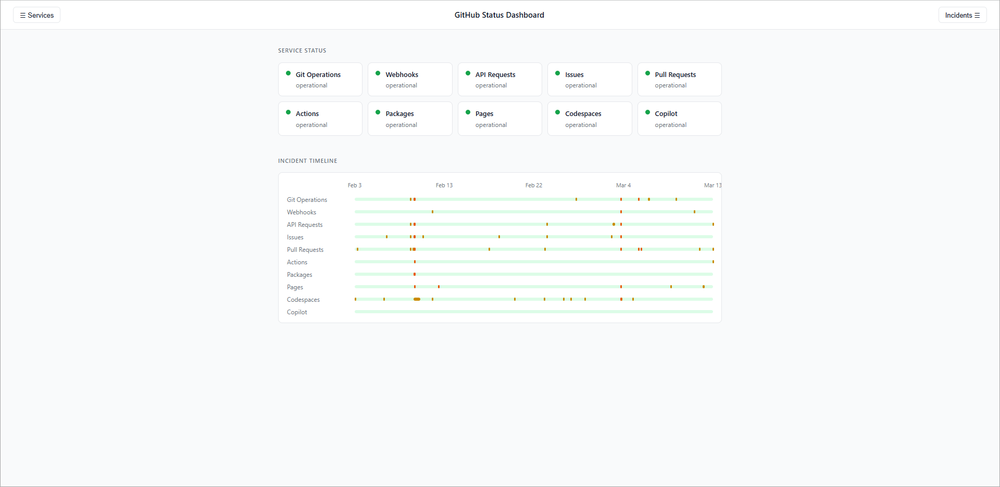
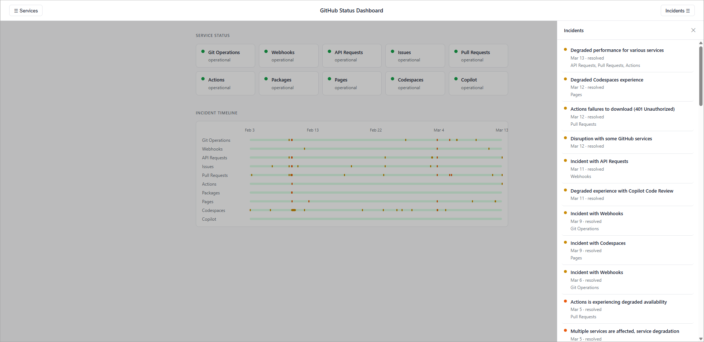
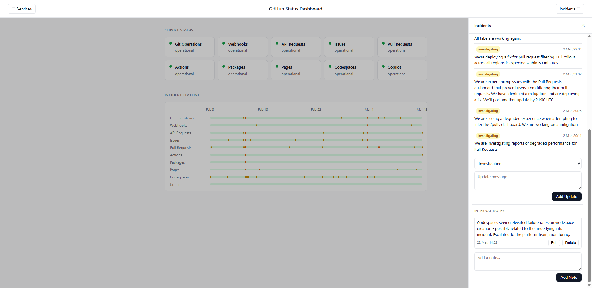

# GitHub Status Dashboard

A fullstack incident/status dashboard built with a .NET Web API, a Node.js API, and a plain HTML/CSS/JavaScript frontend. The frontend fetches from both backends simultaneously and combines the data into a single view - mirroring a real microservices pattern where each service owns a distinct domain.



---

## What it does

- **Service status grid** - shows all monitored GitHub services and their current operational status
- **Incident timeline** - plots incidents per service over time, colored by impact
- **Services panel** - lists all services with their status and description
- **Incidents panel** - lists all incidents with impact, status, and affected services
- **Incident detail** - shows the full update history for an incident and supports internal notes (create, edit, delete)

Seed data comes from [githubstatus.com](https://githubstatus.com) - real incident history for GitHub's own infrastructure.

---

## Architecture

```
Frontend (HTML/CSS/JS)
    ├── fetch → .NET API (https://localhost:7129) → SQL Server
    └── fetch → Node.js API (http://localhost:3000) → SQLite
```

Each backend owns a different domain:

| Backend | Owns | Database |
|---|---|---|
| .NET Web API | Services (monitored systems) | SQL Server |
| Node.js API | Incidents, updates, internal notes | SQLite |

The frontend fetches both APIs in parallel using `Promise.allSettled`, joins services and incidents by integer ID, and handles partial failure - if one API is down, the other half of the page still renders.

---

## How to run

### Prerequisites

- .NET 9 SDK
- Node.js 18+
- SQL Server (Express is fine)

### 1. Seed data

The `.NET` API seeds services automatically on first startup. For incidents, run the Node.js seed script once before starting the API:

```bash
cd backend-node
node seed.js
```

### 2. .NET API

Create `backend-dotnet/appsettings.Development.json` with your SQL Server connection string:

```json
{
  "ConnectionStrings": {
    "DefaultConnection": "Server=.\\SQLEXPRESS;Database=StatusDashboard;Trusted_Connection=True;TrustServerCertificate=True"
  }
}
```

Then run from the repo root:

```bash
dotnet run --project backend-dotnet
```

Note the port printed in the terminal. If it differs from `7129`, update `SERVICES_URL` in `frontend/js/api.js`.

### 3. Node.js API

```bash
npm start --prefix backend-node
```

Runs on `http://localhost:3000`.

### 4. Frontend

Open `frontend/index.html` via a local server - for example VS Code Live Server. Opening as a `file://` URL will block ES modules.

---

## Endpoints

### .NET API - Services

| Method | Path | Description |
|---|---|---|
| `GET` | `/services` | List all services |
| `GET` | `/services/:id` | Get a single service |
| `POST` | `/services` | Create a service |
| `PUT` | `/services/:id` | Update a service (partial) |
| `DELETE` | `/services/:id` | Delete a service |

### Node.js API - Incidents

| Method | Path | Description |
|---|---|---|
| `GET` | `/incidents` | List all incidents |
| `GET` | `/incidents/:id` | Get incident with updates |
| `POST` | `/incidents` | Create an incident |
| `PUT` | `/incidents/:id` | Update an incident (partial) |
| `POST` | `/incidents/:id/updates` | Append an update |
| `GET` | `/incidents/:id/notes` | List internal notes |
| `POST` | `/incidents/:id/notes` | Create a note |
| `PUT` | `/incidents/:id/notes/:noteId` | Edit a note |
| `DELETE` | `/incidents/:id/notes/:noteId` | Delete a note |

---

## How the frontend communicates with the APIs

The frontend is split into four ES modules:

- **`api.js`** - all fetch calls, one function per endpoint
- **`data.js`** - pure data transformations: joining services with their incidents, computing the timeline date range
- **`dom.js`** - all rendering; accepts callbacks for async operations rather than calling the API directly
- **`main.js`** - orchestrates everything: fetches both APIs in parallel, passes data to the DOM layer, provides callbacks that call the API layer

On load, `main.js` calls `Promise.allSettled([fetchServices(), fetchIncidents()])`. If either fails, the available data is rendered and an error message is shown for the unavailable part. Services and incidents are joined client-side by integer service ID.

---

## Screenshots





---

## Reflection

**Strengths**

- The domain split between backends feels natural - services are configuration-like data that belongs in a relational database, while incidents are append-heavy event data where SQLite's simplicity is a good fit
- `Promise.allSettled` for parallel fetching with graceful partial failure took minimal effort but adds real resilience
- Clear separation of concerns in the frontend makes each module easy to read in isolation

**Weaknesses**

- The frontend hardcodes API URLs - changing ports requires a manual update to `api.js`
- No authentication on either API; internal notes are fully public
- Error messages are functional but minimal - a real app would give more actionable feedback

**What I'd improve**

- Add real-time updates via WebSockets or SSE so the dashboard reflects changes instantly when incidents are created or updated, without requiring a page refresh
- Add authentication so internal notes are actually internal rather than publicly accessible through the API
- Deploy both backends and the frontend so the project is linkable rather than only runnable locally
